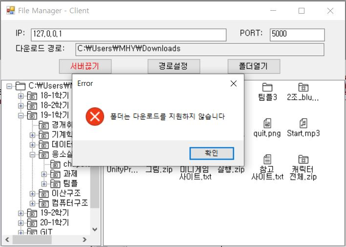

# RemoteFileAccess
2019.05.05 프로젝트 과제  
원격 파일 접속 프로그램
- 소켓 통신을 이용하여 원격으로 파일을 확인하고 다운로드하는 프로그램
- 주요기능
> 소켓통신  
> 탐색기  
> 상세정보 확인  
> 파일전송  

#### 사용 프로그램 및 프로젝트 출력 형식
- Visual Studio 2015 
  - ClassLibrary1 : 클래스 라이브러리
  - PacketServer : Windows 응용 프로그램
  - PacketClient : Windows 응용 프로그램

-------

### 서버, 클라이언트 Form
 

-------

## 서버/클라이언트 연결
1. 서버와 클라이언트에 각각 같은 IP와 PORT 번호를 입력해야 함  
2. Server의 **경로선택** 버튼을 눌러 접속할 경로를 설정해야 함
    + 경로를 선택하지 않고 서버켜기 버튼을 눌렀을 경우  
    
3. Server에서 경로선택 후 **서버켜기** 버튼을 눌러 클라이언트 접속을 대기함
4. Client의 **경로선택** 버튼을 눌러 다운로드 경로를 설정해야 함
    + 경로를 선택하지 않고 서버연결 버튼을 눌렀을 경우
    
5. Client에서 경로선택 후 **서버연결** 버튼을 눌러 소켓 접속을 시작함
    + Server에서 서버를 먼저 켜야 소켓 접속이 가능함  
    + 소켓 접속 시 아래와 같이 서버에서 접속 log를 출력함  
    

## 원격 탐색기 기능
- 클라이언트에서 서버에 접속하자마자 서버에서 설정된 경로의 파일 및 디렉토리 정보를 가져와 클라이언트 TreeView와 ListView에 출력
- 클라이언트의 TreeView의 확장버튼을 클릭 시 필요한 정보를 서버에 요청해 출력
- 클라이언트의 TreeView의 메뉴 선택 시 해당 폴더의 파일 및 폴더를 서버에 요청해 ListView에 출력
    + 선택 시 서버의 로그와 클라이언트 화면의 모습
    
- ListView에서 마우스 우클릭 시 4가지 옵션이 존재 : 자세히, 간단히, 작은아이콘, 큰아이콘  
    + 마우스 우클릭 시 클라이언트 화면 모습
      
    
    + 자세히, 간단히, 작은아이콘, 큰아이콘 순으로 차례대로 4가지 옵션 결과  
      
      
- 클라이언트의 ListView의 폴더를 더블 클릭 시 폴더로 이동 후 파일 및 폴더 정보를 출력
- 클라이언트의 파일의 우클릭 후 상세정보를 클릭하거나 파일을 더블 클릭 시 아래와 같이 상세정보 출력
    + 상세정보 모습  
      
- 클라이언트의 파일의 우클릭 후 다운로드 클릭 시 다운로드 경로로 파일을 다운로드
    + 다운로드 시 서버의 log 모습  
      
    
    + 폴더 다운로드 실행 시 예외 처리
    
    
